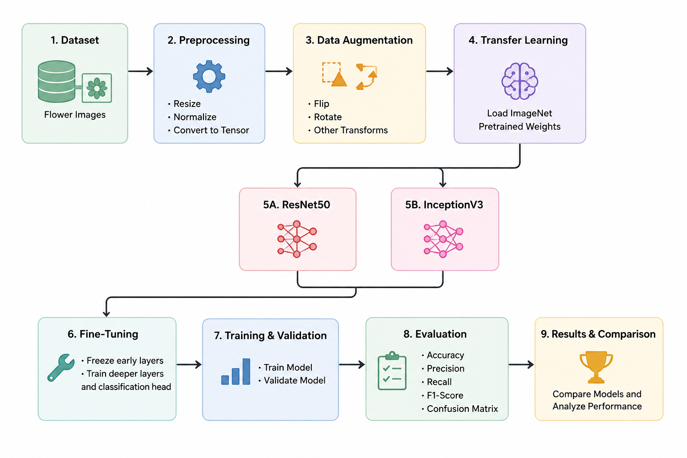

# Flower Classification Using Transfer Learning

## Overview

This project explores transfer learning and fine-tuning for flower image classification using pretrained CNN models. ResNet50 and InceptionV3 were evaluated with and without data augmentation to analyze their performance and generalization capabilities.

## Features

- Transfer learning with pretrained models
- Partial fine-tuning of network layers
- Data augmentation experiments
- Model comparison and evaluation
- Training and validation visualizations

## Models

- ResNet50
- InceptionV3

## Dataset Structure

```text
dataset_split/
├── train/
├── val/
└── test/
```

## Workflow

<p align="center">
  
</p>

The workflow begins with dataset preparation and preprocessing, followed by data augmentation and transfer learning using pretrained ImageNet weights. ResNet50 and InceptionV3 are fine-tuned and evaluated using standard classification metrics to compare their performance. The workflow image is generated using AI.

## Evaluation Metrics

- Accuracy
- Precision
- Recall
- F1-Score
- Confusion Matrix

## Results

- ResNet50 achieved the best overall performance.
- Data augmentation slightly improved ResNet50 results.
- InceptionV3 was more sensitive to augmentation.
- Transfer learning significantly reduced training time while maintaining strong accuracy.

